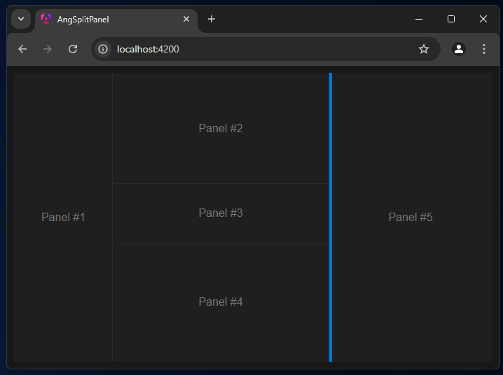

## split panel test app

Example of panel split. Work in progress

```html

<split-container>

	<split-panel [options]="{ size: 200, minSize: 100, canDrag: true }">
		<div class="panel">Panel #1</div>
	</split-panel>

	<split-panel [options]="{ ratio: 2, minSize: 200, }">
		<div class="column">
			<split-container [options]="{ direction: 'horizontal' }">
				<split-panel [options]="{ size: 200, minSize: 100, canDrag: true }">
					<div class="panel">Panel #2</div>
				</split-panel>
				<split-panel [options]="{ ratio: 1, minSize: 50}">
					<div class="panel">Panel #3</div>
				</split-panel>
				<split-panel [options]="{ size: 200, canDrag: true }">
					<div class="panel">Panel #4</div>
				</split-panel>
			</split-container>
		</div>
	</split-panel>

	<split-panel [options]="{ size: 200, canDrag: true }">
		<div class="panel">Panel #5</div>
	</split-panel>

</split-container>

```



